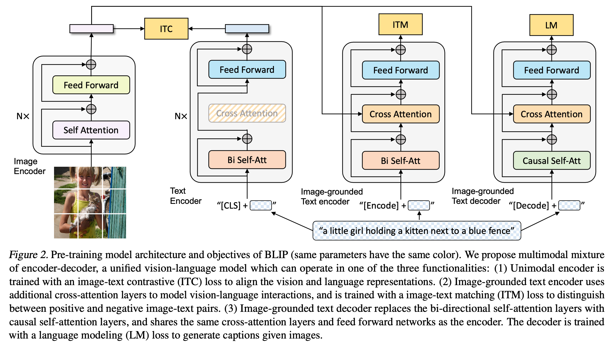
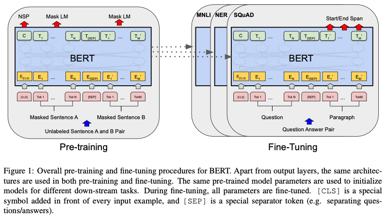

<!-- # Outline
- [Abstract](#abstract)
- [1. Introduction](#1-introduction)
- [2. Related Work](#2-related-work)
  - [2.1 Vision-language Pre-training](#21-vision-language-pre-training)
  - [2.2 Knowledge Distillation](#22-knowledge-distillation)
  - [2.3 Data Augmentation](#23-data-augmentation)
- [3. Method](#3-method)
  - [3.1 Model Architecture](#31-model-architecture)
  - [3.2 Pre-training Objectives](#32-pre-training-objectives)
  - [3.3 CapFilt](#33-capfilt)
- [4. Experiments](#4-experiments)
  - [4.1 Pre-training Details](#41-pre-training-details)
  - [4.2 Effect of CapFilt](#42-effect-of-capfilt)
  - [4.3 Diversity is Key for Synthetic Captions](#43-diversity-is-key-for-synthetic-captions)
  - [4.4 Parameter Sharing and Decoupling](#44-parameter-sharing-and-decoupling)
- [5. Comparison with State-of-the-arts](#5--comparison-with-state-of-the-arts)
  - [5.1 Image-Text Retrieval](#51-image-text-retrieval)
  - [5.2 Image Captioning](#52-image-captioning)
  - [5.3 Visual Question Answering (VQA)](#53-visal-question-answering-vqa)
  - [5.4 Natural Language Visual Reasoning (NLVR2)](#54-natural-language-visual-reasoning-nlvr2)
  - [5.5 Visual Dialog (VisDial)](#55-visual-dialog-visdial)
  - [5.6 Zero-shot Transfer to Video-Language Tasks](#56-zero-shot-transfer-to-video-language-tasks)
- [6. Additional Ablation Study](#6-additional-ablation-study)
- [7. Conclusion](#7-conclusion)
---
--- -->

# Abstract
- 目前的VLP模型性能提升的方式主要是靠擴大資料集⇒ 目前是以網路上的image-text pair 訓練
    - 網路上的data很大的可能存在noise
    - 此論文提出一個**標題產生器**和**去噪器**來處理網路資料集所存在的噪音問題

# 1. Introduction

🎯 **目標：** 提出一個更強大的VLP架構

🕰️ **過去方法**
- 在過去的VLP(Vision -anguage Pretraining) 方法中有兩大層面的限制
    - 模型層面
        - 針對不同的下游應用目前還是有各自適合的架構，還沒有一個能完全統一個的模型
            - 生成任務（e.g. 文字生成）⇒ Encoder-Decoder
            - 理解任務（e.g. 檢索）⇒ Encoder
    - 資料層面
        - 過去方法的訓練資料多來自網路爬蟲所得，存在noise資料未被清理乾淨，且noise帶來的負面影響尚未被適當解決

💡 **本篇方法**

- 針對上述提到的兩大層面問題進行研究
    - 模型層面
        - 提出一個多模態混合（Multimodal mixture）的Encoder-Decoder架構 (MED)
            - 可以在後續應用在更多的下游任務中
            - 保持預訓練時的效率
    - 資料層面
        - 提出一個引導（Bootstrapping）方法來避免noisy image-text pair
        - Finetune一個pre-trained MED成兩個子模組
            - Cap (Captioner) ⇒ 生成合成字幕
            - Filt (Filter)⇒ 過濾掉noisy字幕

🔥 **研究成果**

1. 引導字幕可以提升下游任務的效能，且字幕多樣性越高越好
2. BLIP不僅在Vision-language tasks中有SOTA的效能，在轉移至Video-language tasks中也達到的SOTA且zero-shot的效能

# 2. Related Work

## 2.1 Vision-language Pre-training
- 過去方法的dataset來源多是網路爬蟲，因此存在噪音(noisy)問題，且噪音問題被模型帶來的效果掩蔽 ⇒ 因此提出**CapFilt**
- 不同性質的任務背後的backbone會不同 ⇒ 提出**多模態混合encoder-decoder**
    - understanding-base tasks ⇒ encoder
    - generation-base tasks ⇒ encoder-decoder

## 2.2 Knowledge Distillation
- CapFilt模組類似於student-teacher方法，Captioner透過生成產生字幕來學習語意，Filter透過過濾雜訊來學習語意
- CapFilt可以相輔相成

## 2.3 Data Augmentation
- 語言任務中的DA(Data Augmentation)相較於vision tasks較為困難
- 本篇研究展現了合成字幕對於大規模的vision-language pre-training的成效是不錯的

# 3. Method

## 3.1 Model Architecture
**MED** (Multimodal mixture encoder-decoder) 是一個multi-task modal，並可以提供以下**三種功能**

1. Unimodal encoder
    1. Image Encoder
        - Transformer is better than the object detection model in feature extraction propose
        - 

            
employ <b>Vision Transformer</b>

            
            

            
    2. Text Encoder
        - 

            
employ <b>BERT</b>

            
            

            
2. Image-grounded text encoder
    - Inject **visual information** for  the cross-attention(CA)
    - Use specific task-specific **token [Encode]** appended to the input text to show the purpose is to generate the representation of the image-text pair
3. Image-grounded text decoder
    - Bi-directional attention ⇒ (change to) **causal self-attention**
    - token [Decode] is used to signal the beginning of the sequence
    - end-of-sequence token is used to signal the end

## 3.2 Pre-training Objectives
- **Three** objectives
    - Understanding-based (x2)
    - Generation-based (x1)
- Computation flow
    - vision transformer (ViT): one-pass to save the computation loading
    - text transformer (BERT): three-pass
- **Three Losses**
    - Image-Text Contrastive Loss (ITC) ⇒ Align the representation of vision and text
        - A positive image-text pair should have similar **representation** between image feature and text feature
        - Negative image-text pair should have more different representation
    - Image-Text Matching Loss (ITM) ⇒ Distinguish whether the image-text pair is positive or negative
        - binary classification problem
        - Purpose is to check whether the image and text are matched
    - Language Modeling Loss (LM) ⇒ generate textual description given an image
        - cross entropy loss: maximize the likelihood of the text in an autoregressive manner
- Tricks of Minimizing the training computation
    - Share Weights between text encoder and text decoder, except **SA layers**
    - Main components that makes the encoder and decoder different is the <attention layer>

## 3.3 CapFilt
- **Previous Problem:** limited number of high-quality human annotated image-text pairs $\{(I_h, T_h)\}$
    - e.g. COCO dataset
- **Previous solution and limitation:** Crawl image and alt-text pairs from the website
    - often do not accurately describe the visual content ⇒ **noisy data**
- **Proposed solution:** Finetune CapFilt on high-quality annotated image-text pair (e.g. COCO dataset)
    - Cap (Captioner)
        - finetune with **LM loss** to decode (synthesis) texts $T_s$ of given web images $I_w$
        - $Cap(I_w)=T_s$
    - Filt (Filter)
        - finetune with **ITC** and **ITM loss** to learn whether a text matches an image
        - a text is considered to be noisy if the ITM predicts the input text and image pair is unmatched.
    - Finally combine the filtered image-text pairs with the human-annotated pairs to form a new dataset

# 4. Experiments

## 4.1 Pre-training Details

## 4.2 Effect of CapFilt

## 4.3 Diversity is Key for Synthetic Captions

## 4.4 Parameter Sharing and Decoupling

# 5.  Comparison with State-of-the-arts

## 5.1 Image-Text Retrieval

## 5.2 Image Captioning

## 5.3 Visal Question Answering (VQA)

## 5.4 Natural Language Visual Reasoning (NLVR2)

## 5.5 Visual Dialog (VisDial)

## 5.6 Zero-shot Transfer to Video-Language Tasks

# 6. Additional Ablation Study

# 7. Conclusion