# Abstract

**問題情境**

除了能更真實的合成(生成)圖片，還要能讓圖片內容是可以控制的

**過去解法**

- 研究latent code的解耦合，想辦法透過不同的factor來控制data的變異性

**問題發現**

- 多數研究都專注於2D空間，而忘記我們的世界是3D空間
- 只有少數的研究著重於場景的構成性質(c nature of scenes)
- 目前僅能在單個物件場景下才能有較好結果
- 背景過於複雜或逼真，會導致模型的效果不穩定

**提出方法**

- 讓模型基於一個組合式的3D場景表示來生成物件，來達到圖片合成的可控性。
    - 用神經特徵域來描述場景可以幫助對多物件的解耦合(物件的形狀或外觀)
- 不需要額外的監督即可透過unstructured和unposed的圖片集合來訓練整個網路
- 講此3D場景表示法與神經渲染管道結合，可以生成快速且逼真的圖像合成模型

**達到成果**

能夠將圖片中的物件個別的解耦合出來，並對該物件進行平移或旋轉，改變相機視角

# 1. Introduction

### 前情提要

- 生成和操控逼真的圖像內容是電腦視覺領域一直在努力的目標
    - 若要處理3D資訊，會花費大量硬體資源，及人力創建
    - GAN在近期促進高度逼真圖像合成的進步，可以合成1024*1024高畫質的圖片合成
- 合成逼真的2D圖片並非唯一目標，對於合成過程也要有**簡單**、**一致**的控制方法
    - 許多方法研究如何在未明確監督下，從數據中的學習解耦表示
- 解耦合的解釋各式各樣，通常是指控制感興趣的屬性(物件形狀、大小、姿勢)，且不影響其他屬性
- 大多數的方法都沒有考慮到場景的組合性質，都在2D圖片中操作，而忘記我們的世界是3D空間
    - 會導致糾纏的控制機制不是內建的，而是後來才在潛在空間中發現的
- 在許多應用場景中，3D的合成是很關鍵的，能達到更細緻的合成結果，因此有些研究開始著重於在3D空間上的操作
    - voxels
    - primitives
    - radiance fields

### Contribution

- 提出GIRAFFE，從原始非結構化圖像集訓練出一個可控且逼真的場景生成方法
- 提出兩個主要見解：
    - 將3D場景表示直接合併到生成模型中，可以得到一個更可控的圖像合成
    - 將3D表示法與神經渲染管道相結合，可以實現更快的推理，與生成更逼真的圖像

- 將場景視為一連串的神經特徵場的組合
    - 將場景[體積渲染](https://zh.wikipedia.org/wiki/立体渲染)到一個較低畫素的特徵圖片
- 透過神經渲染過程來處理特徵圖，最後輸出最終渲染圖

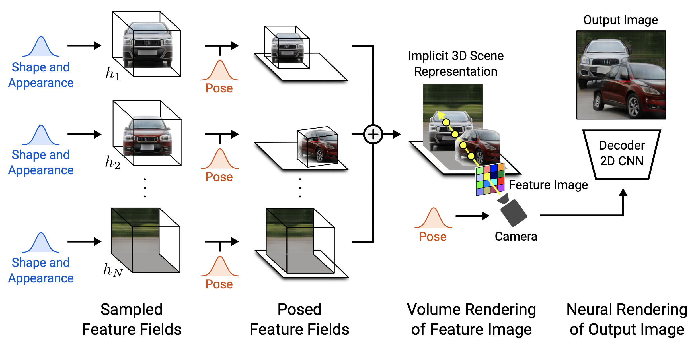

# 2. Related work

### GAN-based Image Synthesis

**目前情況**

- 已被證實可以成功在高解析度(1024$\times$1024)圖片下進行合成
- 多個研究如何在不給予額外監督下，也能對不同的factor進行解耦合
    - 修改訓練目標(training objective)
    - 改變網路架構
    - 研究潛在空間

**遇到挑戰**

- 傳統的GAN方法都沒有明確的模擬場景的構成性質，目前開始研究如何對object-level進行控制

**創新改變**

- 撇開在2D空間的思維，將所有運算轉成在3D空間進行
- 發現能夠達到更好的解耦合且更可控的合成

### Implicit Functions

**目前情況**

- 重塑3D幾何結構，目前也使用重構場景
- 傳統3D的重構是需要大量的人力監督來完成，因此有人提出微分渲染
- 有人提出重要的NeRFs，可以達到在複雜場景下仍能以不同視角的合成
    - 隱涵神經網路模型
    - 體渲染技術

**遇到挑戰**

- 大部分所討論的模型方法都還是需要大量不同視角的訓練資料才能完成

**創新改變**

- 使用NeRFs來表示object-level的東西
- 可使用非結構化的資料集來訓練生成模型，並行對該場景進行逼真且可控的生成

### 3D-Aware Image Synthesis

**目前情況**

- 許多研究在思考如何將3D表示法當作歸納偏置加進生成模型
- 有人提出Generative Neural Radiances Fields (GRAF)
    - 在高解析度的圖片中可以控制合成
    - 僅能使用單一物件
    - 當場景太複雜或近似於現實，效果會變差

**遇到挑戰**

- 使用監督式方法來達到
- 若要處理圖片中的多物件時，會需要額外的監督，而此方法在實際世界中是不實際的

**創新改變**

- 只要使用raw data，不用額外監督處理即可訓練
- 將3D表示法融合進GRAF中
    - 可以同時處理多物件
- 加入神經渲染管道
    - 模型可以處理更複雜且真實的資料

# 3. Method

**目標**

- 在不給予額外監督的條件下，使用raw data即可訓練出一個可控的圖片合成模型

**主要元素**

- 將單個對象分別建模為神經特徵場(Neural feature field)
- 將上述的神經特徵場作為額外的屬性，來合成來自多個單獨對象的場景

**其他方法研究**

- 探索了體積和神經渲染技術的有效組合
- 討論如何用原始圖像集合中訓練我們的模型

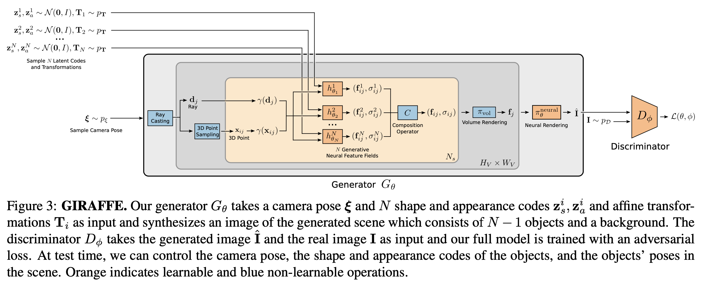

## 3.1. **Objects as Neural Feature Fields**

### Neural Radiance fields

- 透過連續函式$f$，將3D點$x\in \mathbb{R}^3$和視角$d\in\mathbb{S}^2$映射到volume density$\sigma\in\mathbb{R}^+$以及RGB顏色$c\in\mathbb{R}^3$
- 映射公式如下
    - $f_{\theta}:\mathbb{R}^{L_X}\times\mathbb{R}^{L_d}\rightarrow\mathbb{R}^+\times\mathbb{R}^3$
    - $(\gamma(x),\gamma(d))\mapsto(\sigma,c)$
    - $\theta$為網路參數，$L_x, L_d$經過positional encoding後輸出的維度
- 並非直接將$x, d$直接丟進輻射域轉換函數$f$，而是要先進行一個低維至高維空間的轉換（positional encoding），用來促使位置和視角輸入能傳達更多資訊
    - positional encoding是預先定義好的
    - positional encoding函式如下
        
        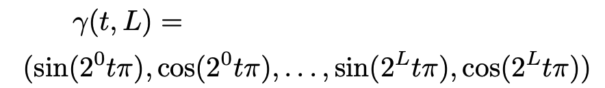
        
    - 使用positional encoding所帶來的效果
        
        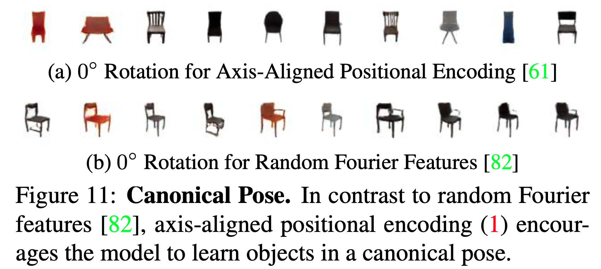
        
- 透過MLP來建構$f$

### Generative Neural  Feature Fields

- 在NeRFs此篇論文中是將模型的塑造是基於許多多角度且單一場景的資料集所建構
- GRAF則是NeRFs加上GAN模型，使得訓練資料不必是特定角度
    - 為了讓模型不受資料集限制，需要對物件的形狀外觀進行encode，並且使用shape和apperance的latent code來限制MLP
    - $z_s,z_a \sim N(0,I)$
    - 公式如下
        
        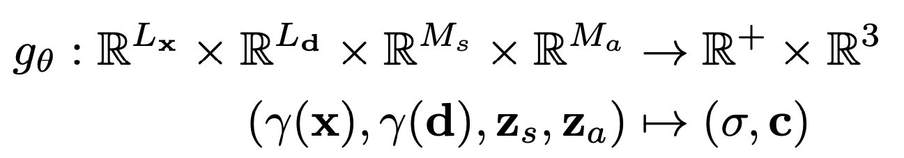
        
    - $M_s,M_a$為shape和appearance經過encode出的維度
- 此篇論文稍微改變GRAF的公式，把原本三維的顏色輸出$c$改成$M_f-$維的特徵$f$，並用以下公式來表達物件的Generative Neural Feature Fields
    
    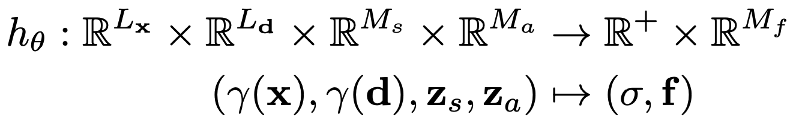
    

### Object Representation

- 上述的方法都是過去研究中，一個GRAF模型只能適用於一個場景中的單一物件，但此篇論文的目標是**個別控制**各個物件的
    - 姿勢
    - 形狀
    - 外觀顏色
- 因此此篇論文將各個物件都分別用一個feature field表示，並同時加入affine transformation的資訊
    - $T=\{s,t,R\}$
    - $s,t\in \mathbb{R}^3$
        - $s$: scale放大倍數
        - $t$: tranlation平移參數
    - $R\in SO(3)$ 為旋轉矩陣
- 由上述參數可以透過以下公式將物件的每個點在場景中進行變換
    - $k(x)=R\ \cdot\ \left [    \begin{array}{cc}
        s_1 &  & \\
         & s_2 & \\
         & & s_3
        \end{array}
        \right ]\cdot x+t$
    - $x$ 為一個3D的點

## **3.2. Scene Compositions**

<aside>
💡 每個場景都是由N個實體組合而成

</aside>

- 依據資料集特性分成兩種情況
    - N是固定的
        - 在該資料集中，每張照片中的實體適量都是一樣的
    - N是可變動的
        - 在該資料集中，每張照片的實體數目可能不一樣
    - 第N個實體為背景本身，但該物體不會被放大或平移（固定不動的實體）
- Composition Operator
    
    <aside>
    💡 將所有實體合成在同個場景中的operator
    
    </aside>
    
    - 單一個實體的特徵場$h^i_{\theta_i}$會由一個給定的3D點$x$和視角$d$，預測出一個密度$\sigma_i\in \mathbb{R}^+$和一個特徵vector$f_i\in \mathbb{R}^{M_f}$
    - $C(x,d)=(\sigma, \frac{1}{\sigma}\sum^N_{i=1}\sigma_if_i)$, where $\sigma=\sum^N_{i=1}\sigma_i$
    - 此運算方式簡單直覺且可以計算梯度

## **3.3. Scene Rendering**

- 3D體積渲染
    - 給定一個相機視角（影響光線）的射線$d$和$N_s$個採樣點得到$\{x_j\}^{N_s}_{j=1}$，$x$為三維空間上的一點
    - 將 $d$ 和 $\{x_s\}^{N_s}_{j=1}$作為參數傳入合成運算子$C(\cdot)$，得到各採樣點對應的密度和特徵向量
        - $**(\sigma_j,f_j)=C(x_j,d)**$
    - 體積渲染運算子將該射線上的量合成為該pixel最終的特徵向量 f
        - $**\pi_{vol}:(\mathbb{R}^+\times \mathbb{R}^{M_f})^{N_s}\rightarrow \mathbb{R}^{M_f}, \{ \sigma_j, f_j \}^{N_s}_{j=1}\mapsto f**$
- 2D神經渲染
    
    <aside>
    💡 經過3D體積渲染後還不是一張2D的RGB圖片，因此還需要一個2D的神經渲染
    
    </aside>
    
    - 2D神經渲染運算子
        - $\pi^{neural}_\theta:\mathbb{R}^{H_V\times W_V\times M_f}\rightarrow\mathbb{R}^{H\times W\times 3}$
        - 3D體積渲染後 $I_V\in\mathbb{R}^{H_V\times W_V\times M_f}$
        - 2D神經渲染後 $\hat{I}\in \mathbb{R}^{H\times W\times 3}$
    
    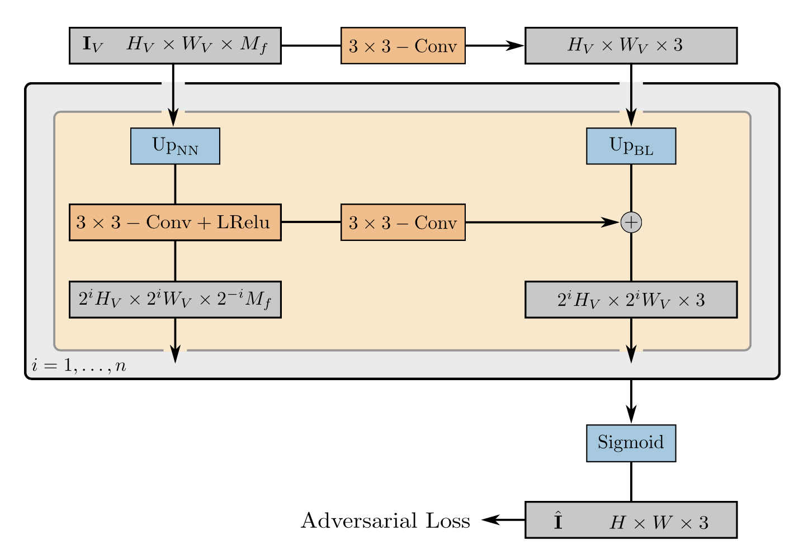
    
    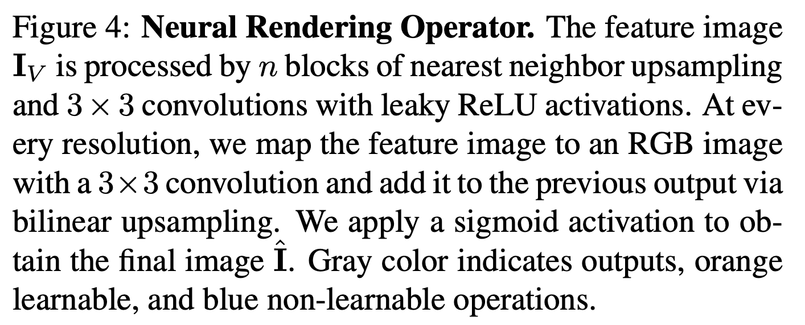
    

## **3.4. Training**

- 生成器
- 判別
- 訓練過程
- 損失函數

## **3.5. Implementation Details**

# **4. Experiments**

- 資料集
    - 單一物件
        - Chairs
        - Cats
        - CelebA
        - CelebA-HQ
        
        <aside>
        💡 背景是純白的（過於單純）
        
        </aside>
        
    - 更複雜、符合現實的單一物件資料集
        - CompCars
        - LSUN Churches
        - FFHQ
        
        <aside>
        💡 物件並非都放在圖片中心，背景更為複雜
        
        </aside>
        
    - 多物件資料集
        - 執行Clevr-N來製造2~5個物件的圖片
            
            
            
- 比較基準
    - voxel-based 基於體素的GAN
        1. PlatonicGAN
        2. BlockGAN
        3. HoloGAN
        
        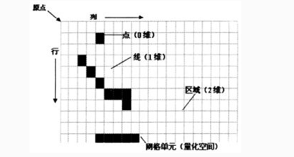
        
        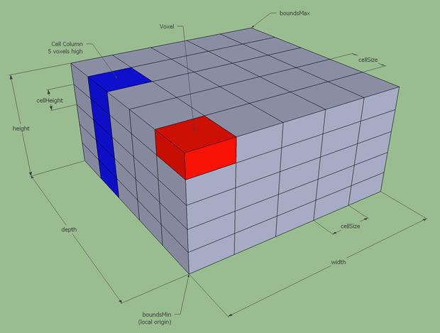
        
    - radiance field-based
        - GRAF
- 評分機制
    - Frechet Inception Distance (FID)
    - 20,000真假樣本來計算FID

## **4.1. Controllable Scene Generation**

- Disentangled Scene Generation
    - 著重於物件是否能從背景中被解開
        - 將合成運算子當作一個加法運算
        - 對個別物件先進行渲染，並套上alpha值
    - 實驗發現模型在非監督式學習下可以將物件解耦合，且生成合理的背景
        
        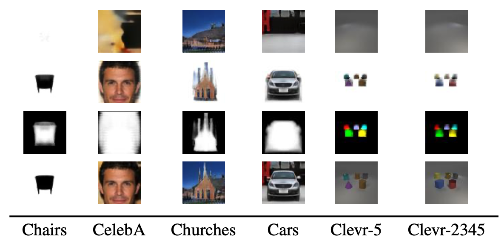
        
- Controllable Scene Generation
    - 由於前實驗已證明物件可以成功地被解耦合，則現在著重的會是物件是否能被單獨的旋轉平疑惑改變外觀形狀
        
        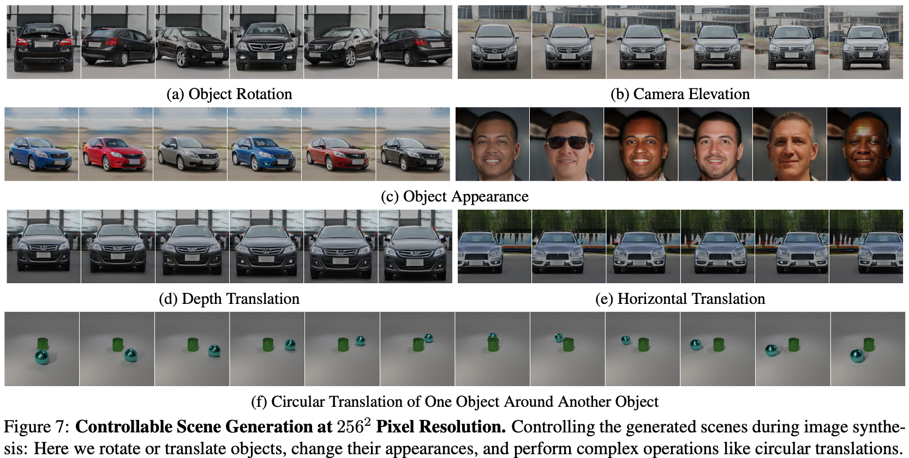
        

- Generalize Beyond Training Data
    - 學習式的合成場景表示法可以讓模型更泛化，而非受限於資料集
    - 例如可以對物件逕行任意的平移或增加更多物件在一個場景中

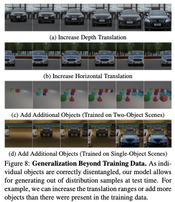

## **4.2. Comparison to Baseline Methods**

- 在像素$64^2$和$256^2$時，此方法的FID分數都是最佳的
- 儘管其他方法在有限的資料集複雜度下都能對圖片合成進行控制，但實驗發現當場景更為複雜時，其他方法較為不穩定，而此論文方法得以將個別物件從背景解耦合出來，因此物件和背景都能各自獨立處理
****

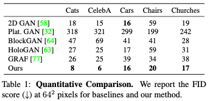

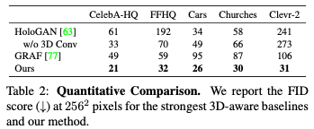

## **4.3. Ablation Studies**

## **4.4. Limitations**

- 資料集偏差
    - 從celebA-HQ資料集發現此資料集內圖片中的眼睛幾乎都是看向鏡頭，而和面向無關，因此在旋轉時會發現眼鏡並沒有隨著臉部的面向不同而感變，而是固定看向鏡頭
    
    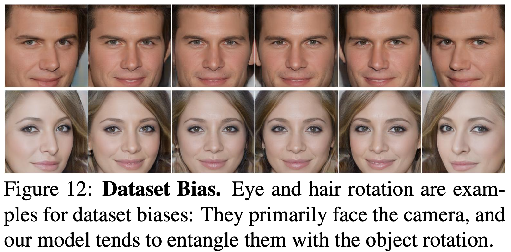
    
- Object Transformation Distribution
    - 有時仍會發生解糾纏失敗，因為相機姿態假設的均勻分布和物件級轉換和真實分布不同

# **5. Conclusion**

- 提出GIRAFFE，先進的可控制圖片合成
- 主要想法貢獻
    - 將合成的3D場景表示法融合進傳統的生成模型中
    - 將場景以物件的神經特徵場表示法合成
    - 在非監督下將獨立的物件從背景中解糾纏
    - 初步進行3D合成後再使用2D神經渲染方法來加速圖片合成
- 未來改進
    - 思考相機姿態的分佈如何從資料集中進行學習
    - ****