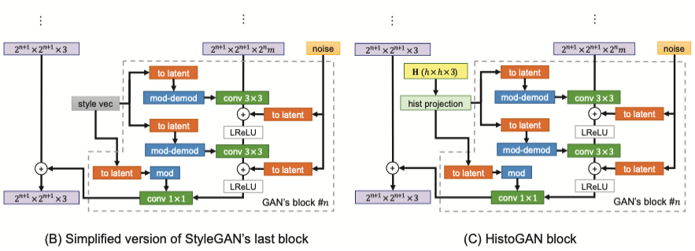
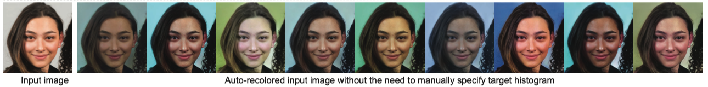
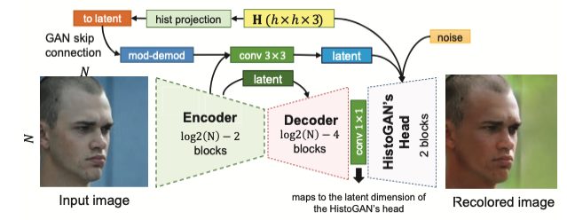

方法不局限於同個domain下的顏色轉換，而是單純就color histogram來轉換顏色，而內容保留

# Main idea

## Scheme

在做圖片的風格轉換時，特別關注於對顏色的控制（可以視為Style transfer的一個sub-category）

## Previous work

## Problems (motivation)

- 基於一張風格目標圖做轉換
    - 可能會影響到被轉換的內容細節（紋理、色調）
- 轉換的品質好壞非常依賴input和target圖片間語意相似性（是否在同一個domain）
    - 想要有好的風格轉換效果就必須在同一個domain下

## Method

- 只藉由color histogram來協助deep network的效果
    - 由此就可以從任意的domain中提取色彩

## Result

---

# Abstract

<aside>
💡 Target: intuitively controlled the appearance(color) of images generated by GANs

</aside>

- HistoGAN
    - based on StyleGAN architecture
    - control the GAN-generated images specified by a target color histogram feature
- ReHistoGAN
    - expend HistoGAN to recolor the generated image
    - encoder
    - unsupervised
    - keep the original images content while changing the colors based on the given target histogram

# 1. Motivation and Related work

顏色直方圖是個很好用來表達圖片顏色的方法，有許多種不同的顏色直方圖來表達顏色分佈

- 3D histogram
- 2D histogram
- color palette
- color triad

**動機**

近期的深度學習模型在做顏色轉換時都是靠一張目標範例進行轉換，且會在同一個domain下。
不同的目標範例（target image）會導致生成出的圖片效果不同，有時候不只更改顏色，連質地、紋理都會變動

**此篇特色**

只專注於控制圖片的顏色特徵，單純藉由顏色直方圖的資訊來協助DL模型

**控制GAN生成圖片的顏色**

- GAN被視為黑盒子能將一個簡單的分佈轉換成一個有意義的範疇，但並沒有能力控制細節
    - 直到StyleGAN出現才開始可以控制更細節的風格
    - 一開始發展了StyleGAN用來對生成的圖片風格進行限制，Style mixing
    - 使用不同的latent space vectors來控制風格
- 達到此目標會有許多的計算花費，也有人另外訓練一個encoder-generator網路來學習一個映射關係
將目標風格轉換成latent code
- 本篇論文希望簡化轉換過程，單純使用color histogram來當作input轉換風格
不受domain的限制，讓不同domain的圖片也可以達到相同的色彩分佈

**重新在真實圖片上著色**

- 利用前一個訓練好的GAN繼續作延伸應用
- 完全非監督學習
- 模型被訓練能夠對顏色直方圖提取特徵與資訊
- 可以不用給定一個目標顏色直方圖就能自動著色
較少研究
- 輸入一張真實存在的圖與一個target histogram就可以轉換顏色

# 2. HistoGAN

首先先介紹本論文是使用histrgram什麼樣的特徵，再來會討論針對於StyleGAN的一些小更動，最後會解釋怎麼擴展該模型來對圖片做重新上色的動作

## 2.1. Histogram feature

- 使用log-chroma的特性
    - 對於光亮的變化有更好的不便性
    - 且是可微分的
- 特徵就是一張圖片的2D直方圖映射到log-chroma空間
    - 此2D直方圖是由$uv$來表達
    - 使用$uv$來表達的顏色空間會比$rbg$來的緊湊
- log-chroma空間是選擇一個顏色作為基底並由另外兩個顏色作歸一化，如此也可以觀察到主色的強度
可以選擇不同顏色，因此特徵圖會是$H=h\times h\times 3$ 的張
    
    [The importance of the normalizing channel in log-chromaticity space](https://ieeexplore.ieee.org/stamp/stamp.jsp?tp=&arnumber=6466987)
    
- histgram的計算方法
    - 一張給定的input $I$ 先轉換成log-chroma空間
    - 舉例選擇R為主色，並對G, B歸一
    $I_{uR}(x)=\log{\frac{I_R(x)+\epsilon}{I_G(x)+\epsilon}}$ $I_{vR}(x)=\log{\frac{I_R(x)+\epsilon}{I_B(x)+\epsilon}}$ 
    其中$x$為pixel index

## 2.2. Color-controlled Image Generation

- 想法是將histogram feature合併至StyleGAN的架構中使用
    - 差別在於在最後一個block，原本是將將風格圖轉成Style vector後再轉成latent code來使用，但本篇論文是本風格圖拿掉，換成Historgram圖，並使用一個projection network再轉成latent code
    - projected into a lower-dimentional representation是什麼意思？
    
    
    
- 此網路架構有8個layer
    - 第一個layer有1024個神經元，其他7個則有512個神經元
    - 橘色的to latent區塊會將histogram feature映射到一個latent space，輸出為$2^nm$神經元  $n$為block編號，$m$ 為一個控制網路容量的變數
- Color loss
    - 使用Hellinger distance
    - $C(H_g,H_t)=\frac{1}{\sqrt{2}}\parallel H^{\frac{1}{2}}_g-H^{\frac{1}{2}}_{t} \parallel_{2}$
    - $\parallel \cdot \parallel_2$ 是標準歐式norm (似乎就是pixel-wise的平方根號)
- Generator的loss
    - $\mathcal{L}=D(I_g)+\alpha C(H_g,H_t)$
    - $I_g$ 是generator生出的圖片
    - $D(\cdot)$ 是個discriminator負責產出一個scalar feature
- 訓練細節
    - 因為loss函數是可微分的，因此可以使用SGD來更新 （Stochastic Gradient Descent）
    - 訓練過程中需要不同的target histogram
        - 隨機在training set中選擇兩張圖並計算其histogram $H_1, H_2$
        - 並隨機的將兩個histogram進行插值
        - $H_t=\delta H_1+(1-\delta)H_2$
        $\delta \sim U(0,1)$
        - 會需要一直產生不同的target histogram是為了增加histogram的變異性，減少overfitting的可能並提高robustness
        - 雖然此方法不適用於多樣性domain的case，但實驗證明每次產生不同的target histogram仍能帶來較好的結果
    
    
    

## 2.3. Image Recoloring

- 擴展HistoGAN的設計來對已知的input $I_i$ 進行著色
- 並非想像中直觀，因為在HistoGAN中控制顏色的部分是隱含在model裡面的（HistoGAN的最後兩個block負責顏色）
- 不使用對noise和style vector進行優化，而是訓練一個encoder，將input映射到HistoGAN可以使用的input

### 架構

- 類似於U-net有個skip connections
- 為了保存input的細節，因此會保留encoder前兩個block的latent feature並透過skip connections來傳到HistoGAN的頭作為細節input
- 修改HistoGAN的架構
    - 可以在最頭的地方丟入target histogram
    - 透過U-Net架構中的skip connections來將前兩個encoder輸出的feature map（histogram的特徵）直接放到尾巴（HistoGAN開始的地方）
    - 此作法（只傳入前兩個block的target histogram特徵）可以讓模型學習在著色的步驟時同時考慮input image content和target histogram的顏色

### loss function

$\mathcal{L}=\beta R(I_i,I_r)+\gamma D(I_r)+\alpha C(H_r,H_t)$

- $R(\cdot)$ 是一個reconstruct的term用來保存input content的細節
- reconstruct的計算方式是使用L1 norm來計算input和recolor圖片的微分距離
- ReHistoGAN有三大目標
    1. 與目標histogram有相近的顏色分佈
    2. 生成的結果要真實
    3. 與input image的content要一樣

# 3. Results and Discussion

# 4. Conclusion
