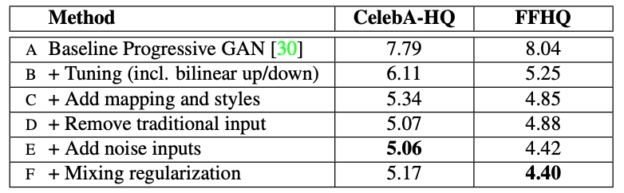

# Abstract

- 此篇論文提出一個新的GAN架構，可以達到以下目的
    1. 自動且非監督式學習將高階的特徵（動作和身份）分開
    2. 利用隨機噪聲達到生成圖片的隨機變化(stochastic variation)
    Ex: 雀斑位置、頭髮文理
    3. 更直觀、特定尺度的合成
- 其他成果：
    1. disentangle latent factors，達到更好的interpolation
    2. 提供兩種量化糾纏基準的指標
    3. 提供一個高畫質且高多樣性的人臉資料集

# 1. Introduction

- 過去在使用GAN生成圖偏食會面臨到以下問題
    1. 整體過程像是黑盒子，對合成過程不了解（隨機特徵的起源）
    2. 對於latent space的特性不熟悉
    3. 沒有一個量化基準來比較不同GAN生成圖片的interpolation
- 提出方法：
    1. 先進的方式來控制圖片合成的流程，從Style的latent code修改各層卷積的資訊，達到在不同尺度下修改風格，同時另外加入噪聲增加隨機性
    2. 透過將input latent code映射到intermediate latent space，可以相對有效的disentanglement
    3. 提出兩個量化disentanglement的基準 （幫助比較不同GAN的成效）
        1. perceptual path length
        2. linear separability

其他貢獻：

- FFHQ資料集（Flickr-Faces-HQ）
    - 高品質
    - 多樣性廣

# 2. Style-based generator

- 與過往的GAN不同，用一個learned const來取代傳統的input layer
    - 過去的latent code只有出現在輸入層，而StyleGAN的input latent code可以輸入至各層卷積
    - StyleGAN將input latent code映射到中介latent space $W$
    - $W$透過AdaIN來控制各層卷積
        
        <aside>
        💡 AdaIN是一個統計方式來進行風格轉換
        精神：先去除原本風格，套用新的風格
        $AdaIN(x_i,y)=y_{s,i}\frac{x_i-\mu(x_i)}{\sigma(x_i)}+y_{b,i}$
        
        [AdaIN 笔记](https://zhuanlan.zhihu.com/p/158657861)
        
        </aside>
        
- 在卷積運算後會加入高斯雜訊
- 架構概述
    - A 是一個預先學習好的仿射轉換
    - B 是一個預先學習好的noise scaling機制
    - mapping網路
        - 8層全連接卷積
    - 合成網路 $g$
        - 18層
        - $4^2-1024^2$的解析度各兩層
    - 輸出層是用$1\times1$卷積來將圖片轉換成RGB
- 比起其他風格轉換方法，風格資訊只從輸入層放入，StyleGAN是將紑格的latent code $w$轉換到各層卷積
- 利用加入額外的噪聲輸入來生成隨機細節
    - 噪聲為一通道的高斯雜訊圖片
    - 放入模型的各層且broadcast to各個feature map
    - scaling 轉換是事先學習好的

## 2.1 Quality of generated images

<aside>
💡 實驗證明：修改GAN架構提升了生成圖像的品質

</aside>

- 總共有6種配置
    1. Progressive GAN Baseline
    2. 配置1加上bilinear up/downsampling計算、訓練更久、tuned 參數
    3. 配置2加上 mapping網路和AdaIN
    在這步驟的訓練發現latent code不用從第一個卷積層輸入
    此時原本傳統的輸入層還存在
    4. 配置3移除傳統輸入層
    此時發現當風格特徵只從旁注入至各層的效果也不錯
    5. 配置4加入噪聲輸入
    6. 配置5使用mixing regularization
- 評分機制使用兩種
    - WGAN-GP
        - CelebA-HQ資料集下所有配置
        - FFHQ的A配置
    - non-saturating loss with $R_1$ regularization
        - FFHQ的B-F配置
- 在展示圖片和影片時會使用truncation trick來確保不會採樣到latent space $W$中的極端區域，而在FID計算分數時並不會適用truncation trick

<aside>
💡 FID分數是用來評價GAN模型的
1.  圖片品質
2. 生成多樣性
分數越低越好，代表兩者(原始輸入和生成)個分佈越接近

[【深度理解】如何评价GAN网络的好坏？IS（inception score）和FID（Fréchet Inception Distance）_月下花弄影-CSDN博客](https://blog.csdn.net/qq_27261889/article/details/86483505)

</aside>

## 2.1 Prior art

- 過去在提升GAN能力時大部分都著重於discriminator的改進
    - 使用multiple discriminator
    - multiresolution discrimination
    - self-attention
- 對於GAN的改善也多著重於input latent分佈
    - 試圖找到最好的input latent分佈
    - 透過高斯混合模ㄕㄕ型來重塑input latent space
    - clustering
- 最近的conditional generator透過額外的embedding網路來將class identifier餵入generator
input latent仍是從輸入層進入模型

# 3. Properties of the style-based generator

<aside>
💡 此StyleGAN架構使得圖片合成可以透過特定尺度的修改來改變風格

</aside>

- mapping network和affine transformation可以視為從一個已知的分佈採樣其中一個為指定風格，並將該風格畫在輸入圖片上
- synthesis network可以視為從一個風格集合中選擇一個風格來生成圖片（此生成的樣子參考input）
- 指定風格的影響是區域性的分佈在網路中
    - 修改一個特定風格的子集合（此風格可能有某種共通性）
    Ex: 此子集合都是短頭髮
    - 則只會影響生成圖片的某個層面
    Ex: 此生成的圖片除了頭髮維持短髮外，其他可能會稍微不同

## 3.1 Style mixing

- 試圖將風格區域化 → mixing regularization
    - 隨機找到兩組latent code $z_1,z_2$
    - 分別將兩組latent code丟入mapping network的到兩個$w_1,w_2$
    - 設定在generative network的某個點要交換風格
    - 一開始先使用$w_1$來生成圖片，直到到達crossover point
    - 換成用$w_2$風格來改變圖片
    
    <aside>
    💡 如此的regulatization方法可以避免網路認為兩個相接的風格是相互關聯的
    
    </aside>
    
- 圖3可以看到當兩種風格在不同尺度下融合會有不一樣的效果

## 3.2 Stochastic variation

在人像上仍有許多特徵本質上就是隨機會發生的

- 頭髮垂放的位置
- 雀斑位置
- 皮膚毛孔

以上的特徵都是隨機出現的，因此只要在不影響整個圖片的感知下，是可以隨機生成這些特徵，只要遵循正確的分佈

**傳統方法**

在傳統方法中所有輸入都由輸入層進入模型中，因此模型需要自己想到一個方法產生偽隨機數，避免被激活韓式影響，使得在需要時能被正確使用

- 消耗大量的模型能力
- 不容易隱藏週期性資訊，導致模型容易產生看起來重複的圖片

**StyleGAN方法**

- 直接在每次卷積運算後加入per-pixel noise
- 圖4可以看到不同噪聲對圖片生成的影響
- 圖５可以看到在不同尺度下使用噪聲帶來的影響

<aside>
💡 發現noise造成的影響在網路中也是區域性的
可能是對於模型要產生夠真實的圖片，噪聲對於模型就是在原本的尺度下做一點改變

</aside>

## 3.3 Separation of global effects from stochasticity

- style可以有全域性的改變，noise可以有較為無關緊要的隨機性特徵變化
- 對應到整個StyleGAN的架構是合理的
    - 風格會影響整張圖因為整個feature map一起被scaled和biased
    Ex: 改變姿勢、光源、背景
    - noise是獨立被加到各個pixel中，適合控制（改變）隨機性
    模型若想嘗試用noise來改變全域特徵（姿態等）會導致生成的圖片缺乏連貫性，此時就會被判別器懲罰，因此生成器不會希望用noise來改變大局

<aside>
💡 透過判別器，生成器可以在沒有額外指導下妥善的使用全域和區域性資訊

</aside>

# 4. Disentanglement studies

### Latent code disentanglement

- latent space包含多個線性的子集合，任一個都是控制風格的某個變異性
- 而在採樣latent code $z$ 時需要對應到訓練資料的密度、分佈（避免產生訓練集外的圖）

### 本篇論文發現

- latent space $W$不用提供從固定的分佈採樣的方法，該採樣的空間密度是來自一個學習來的連續mapping $f(z)$
- $f(z)$可以用來解開$W$，如此factor的變化性會變得更線性

<aside>
💡 模型從一個disentangle的latent space生成擬真的圖entangle的latent space還容易

</aside>

### Disentanglement量化問題

- 過去在量化disentanglement時需要一個encoder來將input map轉成latent code
- 此基準不適合本篇論文的方法，因為要另外訓練一個encoder是不切實際的，勁量避免訓練多餘的東西
- 因此提出兩個量化方法
    - 不需要另外使用encoder
    - 可以應用在任何圖片資料集和生成器上

## 4.1 Perceptual path length

若latent space糾纏的情況很嚴重的話，interpolation可能會有明顯的非線性變化

可以透過觀察interpolation的過程中，變化的猛烈程度來判斷latent space的糾纏有多嚴重

<aside>
💡 越不曲折的latent space其感知上的變化應會更平順

</aside>

- 透過將圖片放入VGG16取得該embedding來計算兩個latent code的差異
- 將一段latent code區分為多個小段計算差距，整條路徑總和即為perceptual path length

## 4.2 Linear separability

<aside>
💡 若一個latent space有效的被解耦合，則在不同獨立的factor中可以找到其對應的vector(方向)

</aside>

- 若latent code的意義都明顯且獨立，則應該可以使用一個超平面將latent space分割成兩項

### 製作細節

- 對生成圖片進行標籤
    - 訓練一個輔助分類器（特徵都是二元）
    - 使用CELEBA-HQ 資料集訓練（包含40種特徵）
- 使用一個SVM來對$z$和$w$進行預測，並計算entropy $H(Y|X)$
$X$是SVM的預測結果、$Y$是自己訓練的classifier分類的結果

### 結果

- $w$相較於$z$可以更被分割 → 耦合性較低
- 透過實驗發現將mapping network加深可以提高影像品質及$W$的分離性
- 即便是在傳統的生成網路輸入層錢前加入mapping network改變原本輸入的分佈，也可以改善GAN的效果

# 5. Conclusion

- style-based GAN的效能遠好於傳統的GAN
- 發現高層次特徵和隨機性的影響
- intermediate latent space的線性變化讓我們對於模型的控制性有更好的理解
- 兩種評價基準可以用來協助訓練時的正規化