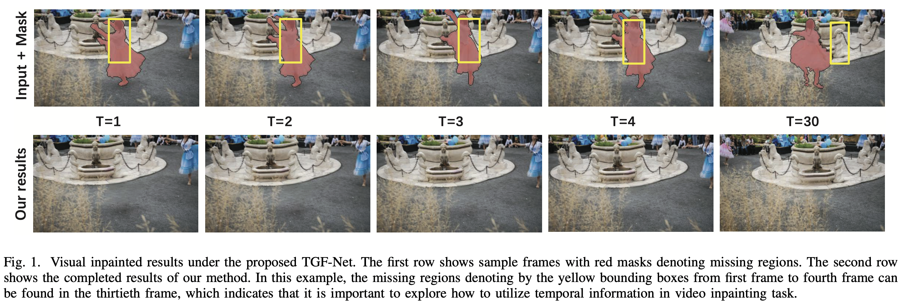
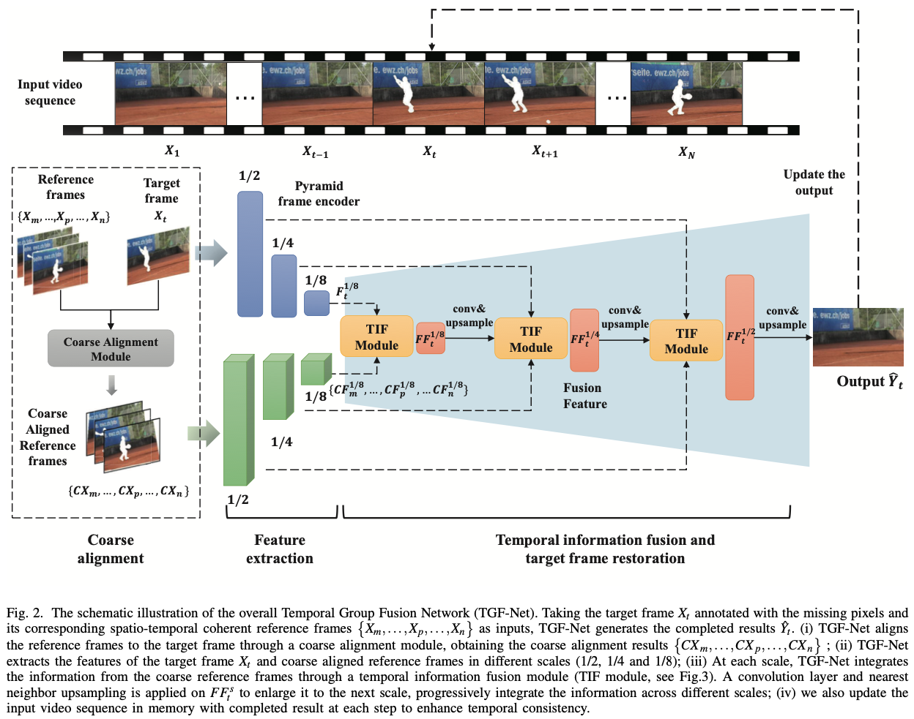
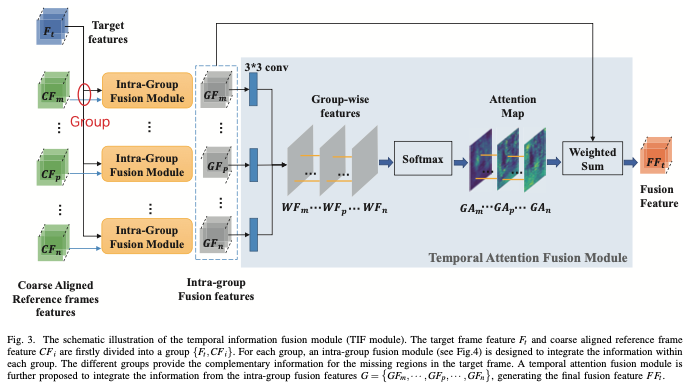
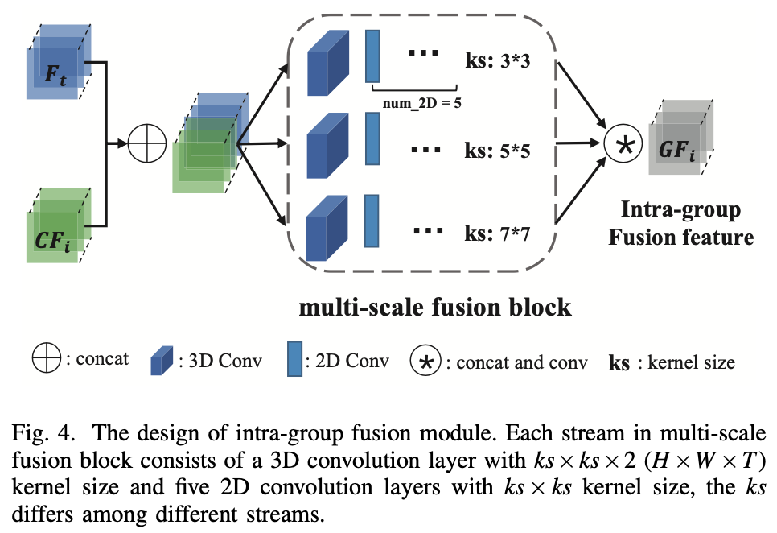
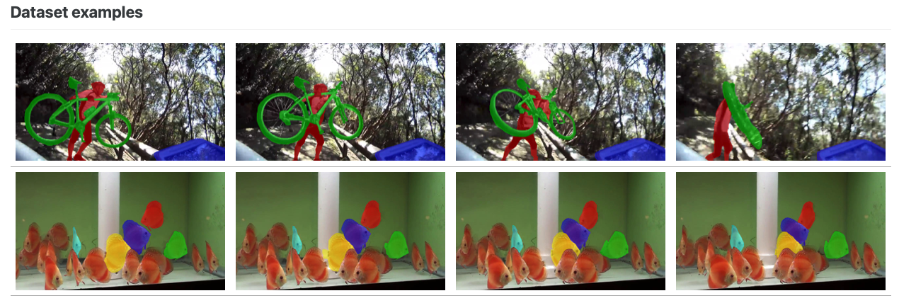
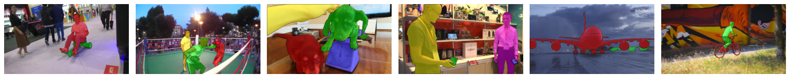
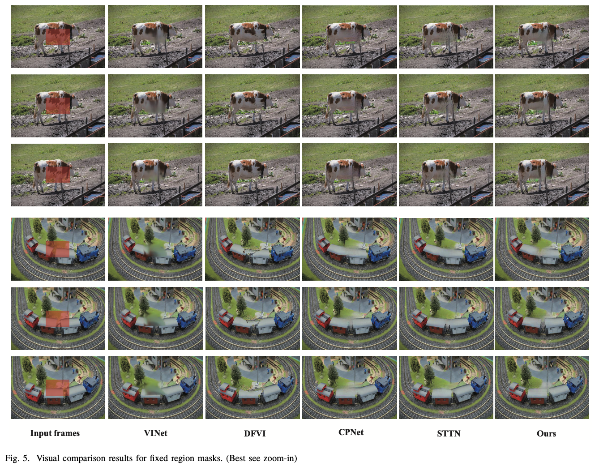
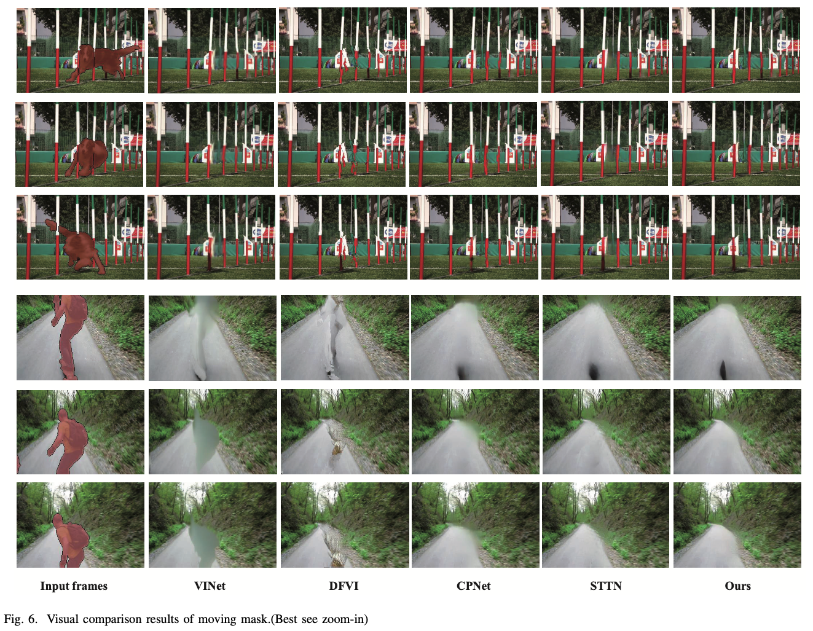

# Abstract

**問題情境**

對一段影片中缺失的區塊進行內容的填補

**過去方法及問題**

- 過去使用的DL方式多使用align的方式將參考frame與目標frame的估計動作的資訊整合在一起
- 問題是上述方法會讓performance高度依賴frame與frame間的align精准度

**提出方法**

- 提出一個Temporal Group Fusion Network (TGF-Net) 來透過兩階段的fusion策略來有效的整合時序上的資訊
    - 階段零：在最初會使用一個粗略的alignment模型來處理large motion
    - 階段一：
        - 輸入的frame會先被分到不同的group中
        - 分類完後使用intra-group fusion module來整合group內部的資訊
        
        <aside>
        💡 不同的group分別提供對缺失區域互補的資訊
        
        </aside>
        
    - 階段二：
        - 使用一個temporal attention model來整合不同group間的資訊

**實驗結果**

- 利用兩階段的fusion策略來整合時序上的資訊，可以避免過度依賴align的結果
- 明顯的提高視覺上的品質以及時序間的相依性

# 1. Introduction

- Video inpainting是一個很基礎的task，重點在於合成一個視覺上貌似真實且在缺失的部分維持時序上的相依性
    - 應用一、修復損毀的影片
    - 應用二、移除不想要的物件
    - 應用三、影片重訂向(video retargeting)
- video inpainting和image inpainting的差異在於video多了時序上的資訊，可以利用連續性的資料來對遺失部分進行更好的填補，因為缺失的部分可能有在其他frame中出現過，例如以下影片中的frame1~frame4中缺失的黃色部份可以在frame30中找到
    
    
    
- 儘管可以在其他frame中找的相關的信息，但因為鏡頭或各種因素，很難直接將該資訊直接應用在填補缺失上，因此要如何妥善利用這樣的資訊是很重要的問題
- 過去CNN方法著
    - 重於alignment在進行fusion
    - 使用3D-CNN來提取特徵（如此會受限receptive field）

### 本篇的特色

- 提出一個novel的end-to-end模型Temporal Group Fusion Network
    - 兩階段的fusion策略
        - 先整合group間的資訊
            - 使用3D卷積來對各個group間的資訊進行整合
            - 在各個group中都有一份target frame，此target frame是用來引導網路提取有意義的時序資訊
        - 在整合不同group間彼此的資訊（善用不同group frame間互補的資訊）
            - 不同group分別提供了不同(互補)的資訊來幫助填補缺口
            - 使用temporal attention model來整合不同group間的資訊
            - 此attention model會學習哪些特徵是有助於修補缺口，並且忽略無效區域
- 兩階段的fusion策略的確讓修補的效果看起來更為真實且保持時序上的連貫相依性，且避免了過度依賴alignment
- 此篇論文的方式仍有限制，感受野上(receptive field)的限制
    - 若影片中具有大規模的動作時會有問題
    - 因此在最初處理時還是會用個粗略的alignlment模型來做一些初步的補償，如此來減少target frame和reference frame間的差異，幫助該論文的模型能專注於object motion

# 2. Related Work

## A. Single Image inpainting

## B. Video inpainting

# 3. Proposed Method

## A. Problem Statement

- $X:=\{X_1, X_2, \cdots, X_T\}$ 是一系列的毀損影片frames，其高為$H$，寬為$W$，frame的長度為$T$
- $M:=\{M_1, M_2, \cdots, M_T\}$ 是上述一系列毀損影片frame中毀損的區域，0為正常的pixel，1為毀損的地方
- $\hat{Y}:=\{\hat{Y_1}, \hat{Y_2}, \cdots, \hat{Y_T}\}$ 為此網路將masked video $X$ mapping到回復輸出的結果，且此結果需要盡可能接近GT $Y:=\{Y_1, Y_2, \cdots, Y_T\}$

## B. Overview$

### 主要概念

- 在影像修復的任務中，物件的移動和視角的變化關係，當前frame中缺失的區域通常可能在其他frame中顯示出來
- 若過去和未來都沒有可以參考修復的frame，則此網路也應該有能力合成未知區域的能力
- 為達到上述的成效，此論文建構編碼器－解碼器架構的網路，用來整合其他frame的時間信息並同時完成單frame的修復

### 提出方法概念

- 將修復任務視為“多對單”問題
    - 按時間逐幀處理影片
    - 提出時間組融合網路TGF-Net
        
        <aside>
        💡 針對每個目標frame（當前要修復的frame）逐步整合不同特徵尺度的參考信息，填充缺失區域並輸出具有空間和時間一致性的合理內容
        
        </aside>
        
        - Step1. 粗略的對齊
        - Step2. 特徵提取
        - Step3. 時間信息融合和目標frame恢復

### TGF-Net概要說明

- 輸入為
    - 目標frame $X_t$ (有標註缺失的區域)
    - $X_t$ 對應的參考frame $\{X_m, \cdots, X_p,\cdots, X_n\}$

- 流程步驟說明
    1. 先將參考frame各自對$X_t$做alignment對齊得到$\{CX_m, \cdots, CX_p, \cdots, CX_n\}$
    2. 將$X_t$和對齊過後的參考frame進行encode 得到特徵$F^s_t$和$\{CF^s_m, \cdots, CF^s_p, \cdots, CF^s_n\}$
        - $s$ 為特徵的尺度 (1/2, 1/4, 1/8)
    3. 利用時間資訊融合模組TIF module來合成不同尺度的特徵，再近一步upsample融合特徵$FF^s_t$到下一個尺度，來漸進式的整合不同尺度的資訊
        - TIF module使用兩階段的fusion策略
            - 階段一、整合group中的資訊
            - 階段二、整合不同group間的資訊
    4. 最後TGF-Net輸出完整的frame $\hat{Y_t}$

## C. Pyramid frame encoder

### 目標：提升時序資訊整合的效率

### 概念

- 金字塔編碼器由low-level特徵到high-level特徵，過程中取得不同尺度下的特徵

### 運作流程

- 拿frame與其對應的binary mask為輸入，並在進入第一層前會先將input在通道的軸上進行concat
- Encoder的結構如下
    - 七卷積層及ReLU激活函數
    - 卷積層使用stride 2來幫助降低解析度 1/2, 1/4, 1/8

## D. Temporal information fusion (TIF) module

### 目標：整合參考frame的資訊

### 概念

- 過去的方法直接使用3D卷積來處理整個影片序列，但如此就會有視野限制，遠距離的參考frame無法有效的被目標frame明確引導，導致時間信息融合不足
- 為避免上述問題，使用TIF模組來將目標frame與各個參考frame group起來
    - 確保目標frame都能確實地引導參考frame該保留哪些有用的資訊
    - 兩階段融合擺脫對於alignment操作的依賴，大大提高修復結果的質量

### 流程步驟：

1. 目標frame和參考frame會先被分在同一個群組中，新的grouped序列表示為  $G=\{G_m, \cdots, G_p, \cdots, G_n\}$，$G_i=\{CF_i, F_t\}$
2. 在各個group中會使用intra-group fusion module來整合group中的資訊，使用3D CNN
    
    <aside>
    💡 不同的group會提供互補的資訊來對target frame中缺失的資訊做填補
    
    </aside>
    
3. temporal attention fusion module會用來整合事先透過intra-group fusion的特徵$G=\{GF_m, \cdots, GF_p, \cdots, GF_n\}$，整合後得到最終特徵$FF_t$wit

### Intra-group fusion module

- 先將$F_t$和$CF_i$堆疊在一起
- 把堆疊後的結果送到multi-scale fusion block來生成intra-group fusion feature $GF_i$
- multi-scale fusion block中的各個stream (不同的scale)包含了兩種結構
    - 一個3D 卷積層 kernel size為$ks\times ks\times 2 \ (H\times W\times T)$
        
        <aside>
        💡 3D卷積層用於時空特徵融合
        
        </aside>
        
    - 五個2D卷積層 kernel size為$ks\times ks$ ，$ks$會依stream不同而異
        
        <aside>
        💡 2D卷積層用來進一步對每組group信息進行深度集成
        
        </aside>
        
- 最後整合分別來自三個不同stream的特徵
    - concat來自三個尺度的特徵並使用$1\times 1$卷積來map到原始的input大小
- 此設計可聚合多尺度的上下文信息，使網路能夠處理不同的物件大小並獲得更精確的完整結果

### Temporal attention fusion module

### 目標：動態的整合跨組間的信息，找到有用的信息，避免無用的資訊

### 概念

- 解決目標frame與參考frame間的遮擋與視差、相機移動的問題，導致不同組的特徵圖信息量不均等
- 利用時間注意力機制來學習每個組的貢獻，以整合來自不同組的信息

### 運作流程

- 使用一個$3\times3$卷積層來對intra-group特徵$GF_i$做下一步的特徵提取，得到一個通道的group-wise特徵圖$WF_i$
- 將透過$3\times3$卷積得到的新的序列$WF=\{WF_m, \cdots, WF_p, \cdots, WF_n\}$沿著時間維度concat在一起
- 再套上一個softmax函式來計算各個位置在時序通道上的attention maps 並以$GA=\{GA_m, \cdots, GA_p, \cdots, GA_n\}$ 表示
$GA_i(x,y)=\frac{e^{WF_i(x,y)}}{\sum^N_{j=1}e^{WF_j(x,y)}}$
    - $N$ 代表group-wise特徵圖的總數
    - $GA_i(x,y)$ 表示attention map $GA_i$在位置$(x,y)$的值
- 最後的融合特徵$FF_t$是由將最初的group fusion特徵$\{GF_m, \cdots, GF_p,\cdots, GF_n\}$與attention maps $\{GA_m, \cdots, GA_p, \cdots, GA_n\}$相乘，再加總
$FF_t=\sum^N_{i=1}GA_i \odot GF_i$
- 在尺度$s$下得到$FF^s_t$，將其使用一個$3\times 3$的卷積來使此$FF^s_t$能被傳遞到下一個尺度做使用
$\tilde{F_t^{s+1}}=(1-M^{s+1}_t)\odot F^{s+1}_t+M^{s+1}_t\odot \tilde{FF}^s_t$

## E. Coarse Alignment Module

### 目標：解決大運動影像時存在的問題

### 概念

- 在使用TGF-Net之前先使用一個粗略的alignment模組來初步的對目標frame和參考frame做初步的簡單對齊

### 運作流程

- 採用自監督對齊損失函式來end-to-end訓練粗略對齊模組
- alignment loss計算目標frame與參考frame之間的L1距離，且計算時不包含毀損區域
$L_{align}=\sum_i\parallel (1-M_t) \odot(CX_i-X_t) \parallel_1$

## F. Loss Function

### 主要訓練目標

1. pixel-wise的reconstruction
2. 知覺相似度 (perceptual similarity)
3. 時空相關性 (spatio-temporal coherence)

### Pixel-wise reconstruction loss

- 限制restored target frame必須在各個尺度下都近似於GT frame，用以漸進式的refine細節
- 將缺失部分與無缺失部分分開計算

$$
L_{py}=\sum_{s=1}^{S-1}\parallel (1-M^s_t)\ \odot \ (Y^s-h(FF^s_t)) \parallel_1+\lambda_{hole}\parallel M^s_t \ \odot \ (Y^s-h(FF^s_t)) \parallel_1
$$

- $h$ 代表一個$1\times 1$的卷積來將特徵圖$FF^s_t$轉換成一個RGB圖片
- $Y^s$ 表示resized成和$FF^s_t$尺度一樣的GT

### Perceptual loss

- 抓到高階語意以及模擬人類感知下的影像品質
- 使用ImageNet-pretrained VGG-16的架構來計算

$$
L{prec}=\mathbb{E}[\sum_i \frac{1}{N_i}\parallel \phi_i(\hat{Y}_{comp}-\phi_i(Y)) \parallel_1]
$$

- $\hat{Y}_{comp}$ 表示網路輸出$\hat{Y}$的缺失部分與輸入$X$無缺失部分的結合
- $\phi_i$ 為pretrained VGG-16的activation map
    - relu1_1, relu2_1, relu3_1, relu4_1, relu5_1

### Style loss and total variation loss

- 用來對恢復frame的視覺品質做更近一步的改善
- 給定一個大小為$C_j\times H_j\times W_j$的特徵圖，其style loss的計算公式如下

$$
L_{style}=\mathbb{E}_j[\parallel G^\phi_j(\hat{Y}_{comp})-G^\phi_j(Y) \parallel_1]
$$

- $G^\phi_j$ 是一個$G_j\times G_j$的gram matrix建構於所選的activation map

### 整體loss函式

$$
L_{total}=L_{py}+\lambda_1L_{prec}+\lambda_2L_{style}+\lambda_3L_{tv}+\lambda_4 L_{align}
$$

- $\lambda_1=0.01, \lambda_2=24, \lambda_3=0.1, \lambda_4=2, \lambda_{hole}=3$

## G. Testing

- 在測試的過程，影片是依照時序順序逐frame放入模型中
- 要完成 t-th frame要拿$X_t, \{ X_m, \cdots, X_p , \cdots, X_n\}$以及其對應的masks當作輸入
- 最後輸入完成的t-th frame $\hat{Y}_t$，並更新到輸入的影片序列中，來提供更多的資訊來幫助接下來的frame進行修復，並得到更好得時序相依性

## H. Temporal Consistency

- 維持時序一致性的方法為在回復完各個frame後都會重新更新回原本的輸入序列中
- 被還原的frame可以做為之後的參考frame，提供更多的資訊給接下來的frame
- 3D卷積可以抓出時空資訊
- 此篇論文提出的TIF module有兩階段的fusion策略
    - 首先使用3D卷積來整合group內的資訊
    - 再來使用temporal attention mechanism來整合不同group間的資訊
    
    <aside>
    💡 可以有效地利用不同frame間的時空資訊
    
    </aside>
    
- 未能讓TGF-Net發揮更大的作用，在整個網路運作前會先使用粗略的alignment module來做簡單的對齊

# 4. Experiments

## A. Datasets

<aside>
💡 使用兩大常被用在video inpainting task的資料集

</aside>

### YouTube-VOS

- 4,453個youtube片段，包含多樣的場景 (適合建立inpainting模型→能夠抓到許多自然場景的分佈)
    - 街道
    - 野外
- 每個clip差不多約3~6秒
- 所有clip平均包含140個frame
- 實際使用
    - training set: 3,471
    - testing set: 508

- large-scale video object segmentation dataset

### DAVIS Dataset

- 包含150個高品質的Full HD影片序列

### 資料集使用方式

- 有兩種mask的方法
    - 移除特定物件
    - 移除特定區域（模擬移除浮水印 ）

## B. Implementation Details

（略）

## C. Baselinesal

### 主要比較方法

- VINet
    - recurrent encoder-decoder network
    - flow warping-based context aggregation
- DFVI
    - 將video inpainting task視為pixel propagation問題
    - 用dense flow field來傳遞其他frame的內容
- CPNet
    - 預測不同frame間的轉換matrics，來對齊frame
    - 用weighting summing來聚集aligned frames的資訊
- STTN
    - 使用multi-scale patch-based self-attention策略來填補遺失的區域

### 比較設定

- 使用作者的pre-train模型
- 256 x 384 frames

## D. Evaluation Metrics

### PSNR

- 評估回復圖片的失真率

### SSIM

- 比較回復圖片與原始GT圖片結構的相似性

### flow warping error

- 上述兩個指標常被用來評價品質，但無法有效的評估temporal consistency
- 因此使用flow warping error來計算兩個frame間的temporal stability

## E. Qualitative Evaluation

- 圖5是測試移除特定區塊
- 圖6是測試移除特定物件

### 發現

- DFVI和VINet都是使用optical flow來對齊不同的frame以及整合其資訊，高度依賴optical flow的準確度
- CPNet採用簡單的全局運動估計來對齊frame，因此在複雜場景的表現會不如預期
- VINet的temporal window只有5個frame，因此

## F. Quantitative Evaluation

## G. Ablation Study

# 5. Conclusion